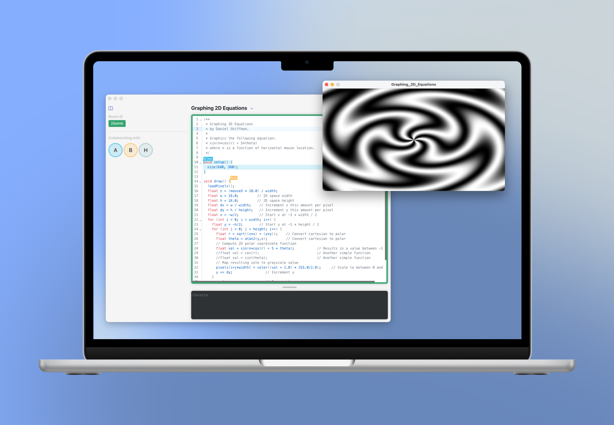

# Processing Collaborative Code Editor

## Description
This project is a prototype for a new collaborative code editor designed for the Processing Foundation (2024 pr05). It aims to enhance the coding experience for Processing users by providing a platform for real-time collaboration.

## Download
To directly download the app, visit the [landing page](https://doradocodes.github.io/processing-collab-editor/) and download the latest version.
You can also view the releases [here](https://github.com/doradocodes/processing-collab-editor/releases).

## Installation
To get started, visit the project's [landing page](https://doradocodes.github.io/processing-collab-editor/) and download the latest version. 

### macOS
1.   Unzip the downloaded file.
2.   Move the `.app` file to your Applications folder.

### Windows

1.  **Unzip the Downloaded File**:
    
    -   Right-click the downloaded `.zip` file and select “Extract All…” to unzip it.
2.  **Move the Entire Folder**:
    
    -   After unzipping, move the entire folder (e.g., `Processing.Collaborative.Editor-win32-x64-1.0.4`) to your `Program Files` directory. 
3.  **Create a Shortcut** (Optional):
    
    -   For easy access, right-click on `Processing-Collaborative-Editor.exe`, select “Create shortcut,” and place the shortcut on your Desktop or Start Menu.
4.  **Run the Application**:
    
    -   Double-click `Processing-Collaborative-Editor.exe` inside the folder in `Program Files` to launch the app, or use the shortcut if you created one.

### Linux
Currently, Linux is not supported. If you're interested in contributing a Linux build, please open an issue or submit a pull request!

For a list of stable releases, visit our [Releases page](https://github.com/doradocodes/processing-collab-editor/releases).

## Local setup
1. Clone the repository to your local machine.
2. Install dependencies by running `npm install` in the project directory.
3. Download JDK 17.0.8 from the [Oracle Archive](https://www.oracle.com/java/technologies/javase/jdk17-archive-downloads.html) and extract it into the `/tools/PlugIns` directory.
4. Launch the development version of the Electron app by executing `npm run start`.

## Build Instructions
### Building for macOS
1. Create a `.env` file with your credentials by copying the `.env.example` file and populating it with the necessary information from your Apple Developer account.
2. Execute `npm run sign_processing` to sign the Processing library for notarization (required for macOS builds only). This step is only necessary when packaging the app for the first time.
3. Package the app for macOS by running:
   - `npm run make:mac` for Apple Silicon chips
   - `npm run make:mac64` for 64-bit Intel chips
4. The packaged application will be available in the `/out` folder.

## Available Scripts
- `npm run build`: Compiles the front-end React app
- `npm run dev`: Launches both the Electron and React apps in development mode
- `npm run dev:react`: Starts only the React app in development mode (used as part of `npm run dev`)
- `npm run dev:electron`: Launches only the Electron app in development mode (used as part of `npm run dev`)
- `npm run package`: Packages the Electron app
- `npm run make`: Uses Electron Forge to package the app for your default OS into the `/out` folder (Note: This process may take some time due to the inclusion of the Processing library)
- `npm run make:win`: Packages the app for Windows using Electron Forge
- `npm run make:mac`: Packages the app for macOS (Apple Silicon) using Electron Forge
- `npm run make:mac64`: Packages the app for macOS 64-bit (Intel) using Electron Forge
- `npm run make:linux`: Packages the app for Linux using Electron Forge
- `npm run sign_processing`: Signs the Processing library for notarization (macOS builds only). This script needs to be run only once, when packaging the app for the first time.

## Websocket Server
The server code for the WebSocket server is available in the [PCE-Server](https://github.com/doradocodes/pce-server) repository.

## Contributing
Please read [CONTRIBUTING.md](CONTRIBUTING.md) for details on our code of conduct, and the process for submitting pull requests.

## Acknowledgements
A thank you to the Processing Foundation for the opportunity to work on this project. Special thanks to Sinan Ascioglu, Ted Davis,
Raphaël de Courville, Stef Tervelde for their guidance and support throughout the design and development process of this project.

## License
This project is licensed under the GNU General Public License v3.0 - see the [LICENSE](LICENSE) file for details.
